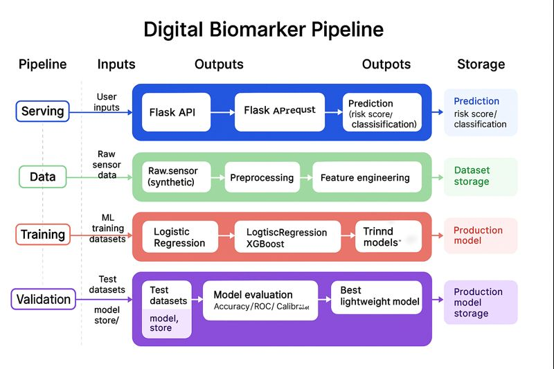

## 🧠 Synthetic-Digital-Biomarker-Pipeline
## 🧬 End-to-End Synthetic Digital Biomarker Pipeline (Wearables + Cognition + ML)

This project simulates an end-to-end digital biomarker pipeline similar to Apple Watch mobility & cognition research.

It generates synthetic wearable data, cleans it, engineers features, performs QC, builds a feature store, and trains ML models:

Mobility biomarkers Cognition biomarkers Deep-learning inspired synthetic pattern generation

Multi-model analytics (Logistic Regression, XGBoost, PyTorch MLP)

A modular, production-style ML system designed for portfolio, interviews, and real-world pipelines.

  

#  2 What This Pipeline Includes

✔ Synthetic Data Generation Mobility + cognition biomarkers (step stability, gait variability, reaction time, memory tests)

✔ Data Preprocessing Cleaning Scaling Noise modeling Outlier correction

Variability featuresT emporal aggregationsInteraction features

✔ SQL-Style QC

Missingness checks Range validation  Consistency rules

✔ Feature Store Production-style tables for ML ingestion ✔ Machine Learning Models

Logistic Regression XGBoost PyTorch MLP (GPU accelerated)

✔ YAML Configuration + Modular Architecture

Clean, extensible, interview-ready design.

# 🔥 4. Model Architecture: PyTorch MLP (GPU-Accelerated)

The deep learning model includes:

Input normalization Two hidden layers ReLU activation Dropout regularization CUDA acceleration when available

# Used for risk prediction and biomarker classification tasks.

# 📂 5. Project Structure (Clean Markdown Tree)
Synthetic-Digital-Biomarker-Pipeline/
│
├── config/
│   └── params.yaml
│
├── data/
│   ├── raw/
│   ├── processed/
│   └── features/
│
├── models/
│   ├── logistic_model.pkl
│   ├── xgb_model.pkl
│   └── torch_model.pt
│
├── notebooks/
│   └── EDA.ipynb
│
├── feature_store/
│   ├── mobility_features.csv
│   └── cognition_features.csv
│
├── src/
│   └── synthetic_digital_biomarker/
│        ├── generate_synthetic_data.py
│        ├── preprocess.py
│        ├── feature_engineering.py
│        ├── feature_store.py
│        ├── sql_pipeline.py
│        ├── sql_qc.py
│        ├── models/
│        │    ├── train_model.py
│        │    ├── torch_model.py
│        │    └── evaluate.py
│        └── __init__.py
│
├── main.py
├── requirements.txt
└── setup.py

# 📈 6. Model Performance Summary
Metric	Score
Logistic Regression	~0.75
XGBoost	~0.75
PyTorch MLP	~0.75

Includes GPU support via CUDA.

# 🧪 7. Training + Pipeline Workflow (MLOps Overview)

The entire project follows a production-grade ML workflow:

✔ Modular Code Design

src/synthetic_digital_biomarker/ contains reusable functions and pipelines.

✔ Configuration via YAML

Edit parameters in config/params.yaml.

✔ Experiment Tracking

(Mlflow-ready structure)

✔ Data Versioning (Optional DVC Integration)

Raw → processed → feature store

✔ CI/CD Ready

Supports GitHub Actions, Docker, AWS EC2/ECR deployment.

# 🧠 8. Why This Pipeline Matters

Digital biomarkers enable:

Early detection

Longitudinal monitoring

Cognitive health assessment

Mobility decline tracking

Wearable-based risk profiling

Your pipeline demonstrates end-to-end mastery of ML systems, from raw signal → features → models → deployment structure.

# 🚀 9. How to Run the Project

git clone https://github.com/sohel10/Synthetic-Digital-Biomarker-Pipeline
cd Synthetic-Digital-Biomarker-Pipeline

pip install -r requirements.txt

python main.py

# 🧰 10. Technologies Used

Python 3.10

pandas

numpy

scikit-learn

xgboost

torch (GPU accelerated)

pyyaml

Run this to export as env variables:

1. Login to AWS console.
2. Create IAM user for deployment
#with specific access

1. EC2 access : It is virtual machine

2. ECR: Elastic Container registry to save your docker image in aws

# Description: About the deployment

1. Build docker image of the source code

2. Push your docker image to ECR

3. Launch Your EC2 

4. Pull Your image from ECR in EC2

5. Lauch your docker image in EC2

# Policy:

1. AmazonEC2ContainerRegistryFullAccess

2. AmazonEC2FullAccess
3. Create ECR repo to store/save docker image
- Save the URI: 404925354687.dkr.ecr.us-east-1.amazonaws.com/kidney
4. Create EC2 machine (Ubuntu)
5. Open EC2 and Install docker in EC2 Machine:
# optinal

sudo apt-get update -y

sudo apt-get upgrade

#required

curl -fsSL https://get.docker.com -o get-docker.sh

sudo sh get-docker.sh

sudo usermod -aG docker ubuntu

newgrp docker
6. Configure EC2 as self-hosted runner:
setting>actions>runner>new self hosted runner> choose os> then run command one by one
7. Setup github secrets:
AWS_ACCESS_KEY_ID=

AWS_SECRET_ACCESS_KEY=

AWS_REGION = us-east-1

AWS_ECR_LOGIN_URI = demo>>  566373416292.dkr.ecr.ap-south-1.amazonaws.com

ECR_REPOSITORY_NAME = simple-app
About MLflow & DVC
MLflow